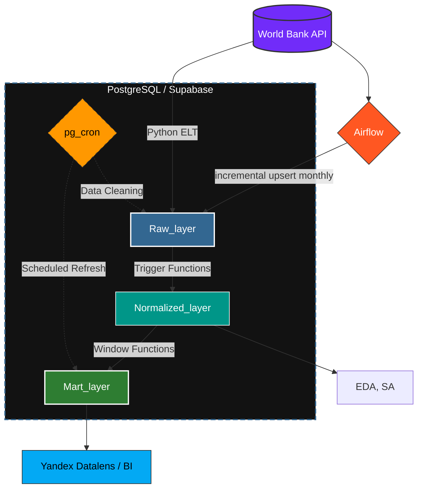
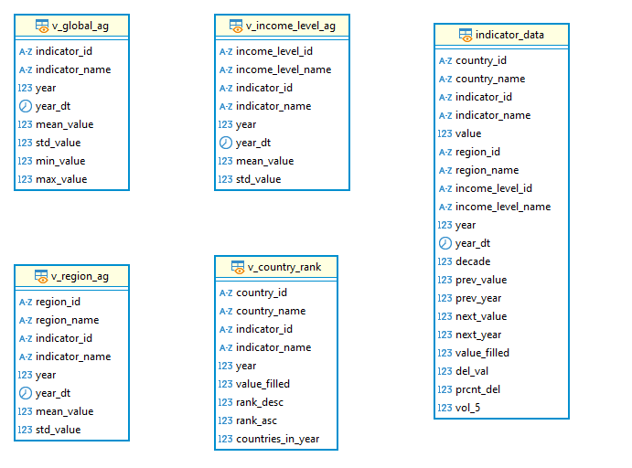

# WB_data_collector

## Содержание
- [Цель и задачи](#title0)
- [Хранилище данных](#title1)
  - [Postgresql](#title1.1)
  - [Инициализация хранилища данных](#title1.2)
  - [Архитектура хранилища данных](#title1.3)
- [WorldBank API](#title2)
- [Pipline](#title3)
- [Airflow](#title4)
- [Анализ](#title5)
  - [Анализ в Python](#title5.1)
  - [BI](#title5.2)

## <a id="title0">Цель и задачи</a>

***Цель проекта*** - подготовка исторических данныых (социально-экономических показателей стран) из всемирного банка ([World Bank](https://datahelpdesk.worldbank.org/knowledgebase/topics/125589)) для анализа 

***Задачи***

1. Выбрать основу для хранилища данных, а также разарботать его структуру
2. Настроить взаимодействие с сервером WB для получения данных по API
3. Реализовать ETL/ELT пайплайн для загрзки данных из API WB в наше хранилище
4. Провести анализ

***Стек***

- Хранилище данных: СУБД Postgres (Облачная на базе Supabse, локальная docker), DBeaver (для работы с локальной СУБД)
- Работа с хранилищем и загрузка данных: Python, SOLalchemy, psycopg2, pg_cron
- Взаимодействие с API: Python, requests
- Анализ в Python: Python, pandas, numpy, matplotlib, seeaborn, plotly, sklearn (PCA, кластериизация и линейная регрессия), scipy
- Визуализация: Yandex Datalens
- Служебные операции: pg_cron, Airflow

***Результаты***

1. Архитектура и инженерия данных (ETL/ELT)

 - Проектирование хранилища: Спроектировал и реализовал трёхслойное хранилище (Raw → Normalized → Mart) в PostgreSQL/Supabase.

 - Автоматизация процессов: Настроил автоматический ELT-пайплайн с использованием триггеров БД и планировщика pg_cron, исключив ручные операции.

 - Надёжная загрузка: Разработал отказоустойчивого клиента для World Bank API с потоковой обработкой, retry-логикой (tenacity) и batch-операциями UPSERT.
   
 -  Инфраструктура: Обеспечил модульную структуру кода воспроизводимость через Docker Compose бд для тестов.

2. Аналитика и визуализация
 - Задача: Исследовать влияние социально-экономических и демографических факторов на ожидаемую продолжительность жизни в странах мира.

 - Анализ: Провёл полный EDA, статистический анализ (корреляции), применил метод главных компонент (PCA) и кластеризацию K-Means для сегментации стран. Построил модели линейной регрессии для оценки влияния факторов и проверил значимость различий (критерий Краскела-Уоллиса).

 - Визуализация: Создал интерактивный дашборд в Yandex Datalens для мониторинга динамики показателей.

[дашборд](https://datalens.ru/l58lqbi9o6em5-dinamicheskiy-analiz-socialno-ekonmicheskih-i-demograf)

[анализ](https://disk.yandex.ru/d/lsGzxEI_YhxELg)

## <a id="title1">Хранилище данных</a>

### <a id="title1.1">СУБД</a>

В первую очередь почему я выбрал Postgres в роли СУБД. Во первых данные получаемые из WB удрбно представлять в виде "сущность-связь", для этого отлично подходит реляционная модель данных. Postgres в целом довольно унверсальное опенсорс решение (как для OLTP так и OLAP задач). Для аналитики достаточно инструментов, начиная от агрегирующих функций, заканчивая оконными фукциями, удобно хранить аналитические отчеты в виде материализованных предсталний. Postgres полностью поддерживает ACID, любое изменение данных (даже при ошибках или сбоях) будет выполнено надежно, полностью и предсказуем; более легкое возможность изменения и удаления данных. Есть дополнительные расширения по типу cron

В рамках проекта я развернул локальную СУБД с поомщью контейнера docker - часть для отладки скрипта загрузки. Также я решил развернуть хранилище в облаке на базе Supabse. Во первых это интересно с точки зрения рельности - намного интереснее подключится к рельному сервису, причем бесплатно. Это в свою очередь накладывает определенныые ограничения но о них позже. Облачныый сервис нечто большее, делает работу с данными удобнее, есть уже встроенные инстурменты, которыми можно пользоваться сразу без дполнительной настройки(к примеру встроенный RESTApi. 

### <a id="title1.2">Инициализация хранилища данных</a>

Хранилище с даными можно инициализировать и заполнить прямо в скрипте. Для работы с подключением в Python, а также для загрузки данных в бд используется библиотека `sqlalchemy 2.0` в связке с `psycopg2` (библиотека для работы именно с СУБД postgres. Логика подключения вынесена в отдельный модуль. Отельный модуль для работы с хранилищем данных: реализованы основные необходимые методы: удалением данных, загрузкой. Структура хранилища данных описана в *декларативном* стиле с использованием `sqlalchemy 2.0` (таблицы). Это двольно удобно, более строгая типизация, удобство разового создания или удаления всех таблиц, использоание базового класса Base, позволяет объединять общие методы работы а также атрибуты для всех таблиц. Однако в проекте иницализация реализована смешано. Создане слоев, триггеров и соответсственно удаление реаизуется через выполнение raw_sql скриптов и *привязано* к событиям `Base.metadata.create_all()` `Base.metadata.drop_all_all()`, этоо все производится неявно и автоматически чтобы избежать ошибок неправильного порядка вызова при иницализации, а также чтобы скрипт был идемпотентен

Вообще в целом структура лежит в директории [models](https://github.com/ososovyan/WB_data_collector/tree/main/src/database/models): здесь лежит все, скрпты для иницализации, модели данных. То есть модуль работы с даными  вне конттекста архитектуры хранилища данных, что позволяет *переиспользовать* для решения других задач или для расширения проекта другими моделми данных

### <a id="title1.3">Архитектура хранилища данных</a>

Как можно было увидеть выше хранилище имеет три слоя

- ***Raw_layer***

  

  Слой для сырых данных полученных прямиком из апи. Таблица -> есть апи ответ от ендпоинта. В данном слое три таблицы две для справочников (общая информация о странах, о индикаторов) и таблица фактов (с показателями для страны за годы). В последнюю таблицу сразу выгружаются данные о нескольких показателях, путем авотматического перебора эндпоинтов api wb, для разных показателей. Также содержит ответ в формате json (можно хранить в формате jsonb для более оптимальной работы в postgres c noSQl моделями данных (возможно стоило грузить сырые jsonb и их обрабатывать в таком виде) однако они нужны номинально для истории загрзки, при необходимости можно изменить, тут больше про возможность работы с разными типами данных)

  Загрузка осущетсвляется батчами с возможностью выбора мода ('ON CONFLICT DO NOTHING', 'ON CONFLICT DO UPSERT') первый для загрузки при инициализации, второй для дозагрузки или обновления. Это позволяет быстро развернуть без лишних нагрузок, при этом обновлять исторические данные последних лет.

  Как видно связей нет чтобы избежать лишних конфликтов при загрузке

  Старые данные с этого слоя чистятся спустя какое-то время с помощью cron

- ***Normalized_layer***

  

  Данный слой содержит данные нормализованные, этот слой основное хранилище данных. Тип "Снежинка" - свзяи таблицы фактов, с основными справочными таблицами на данном этапе виртуальные (семантика столбца country_id не совсем страна, поскольку wb выдает данные не только для стран но и для агрегированных групп, регионов, фильтрация разумаается будет, но уже в слой mart, поскльку данные по агрегированным регионам и группам возомжно использовать при анализе.

  Этот слой используется для разведочного и структурного анализа в Python

  Этот слой заполняется автоматически по тригеру (событие INSERT, UPDATE) и перетекает по мере загрузки или обновления данных, это разумеется нагружает работу бд, при вставке батчей начинается одновременная обработка, однако это обеспечивает целостность данных

- ***Mart_layer***
  
 

  Это слой аналитики. Основа плоское материализованное представление для стран, лет, индикаторов (здесь как раз произведена фильтрация по странам для значений показателей. Также в этом слое лежат обычные представления для помощи в анализе, скорее не физически а просто для разделения назначения. Также произведена линейная интерполяция пропущенных значний, подсчет некоторых метрик для показателей.

  Этот слой используется BI системами

  Материлизованное представлние инициализируется при инициализации бд, также автоматически обноляется по окончании загрузки данных в таблицу фактов. Интересная деталь поскольку мы реализовали переход из raw - > norm триггером, используется одна и та же транзакция, загрузка формально не закончится до тех пор пока база не прольет послдний батч в нормализованный слой, поэтому обновление будет происходить корректно и лишь после проливки всех данных, это проиходит на уровне скрипта

  на всякий случай обновляется переодически через cron с ипользванием одной и той же процедуры

## <a id="title2">WorldBank API</a>

Для работы с API WB реализован клиент, который умеет подключаться к API WB и получать типовые данные, нужные для инициализации, например данные по всем странам или список покаазателей

Он базуриется на клиенете, который можно взять за основу для установления в рамках данного проекта другого http соединения

Клиент реализован с использованием библитоеки request. Особенности клинета:

- Отработка пагинации
- Ретрай логика реализованная через tenacity (отказоустойчивость)
- контекстный менеджер сессий; в рамках одного запроса мы открываем сессию, и не закрываем ее до ех пор пока не выгрузим все, это полезно при выгрузке больших объемов (позволяет не подключаться для получения каждой страницы, кааждый раз, что ускоряет время получения ответа, и позволяет избежать блокировки)

## <a id="title3">Pipline</a>

Эта часть скорее про быстрое автоматическое развертывание бд и оркестрацию соединениями

Вообще осбенность в том что обработка данных потоковая. Мы страницами выгружаем даные из API лениво, лениво собираем батчи и загружаем их в бд. То есть максимальный объем используемой памяти не больше чем сумма размера еденичного ответа апи и размера batch для загрузки в бд. Мы выравниваем поток страниц получаемых от апи в поток словарей.

Вообще архитектура комбинированная - комбинация ETL и ELT. То есть часть обязанностей по трансформациии мы переложили на саму бд (а именно функции тригеры). Однако перед попаданием в бд данные фильтруются через мапперы, это нужно для строгой типизации модели и ответа апи. То есть маппер нужен для парсинга сырого json в объект модели данных, после чего модель джанных сама представляется в виде словаря для заливки в бд, использование именно моделей данных которые были иницализирвоаны в бд снижает риск появления ошибки в процессе передачи между апи и бд.

Методы есть удобные инструменты для иницализации, наполнения и поодеражания целостности бд в автономном режиме. Aggparser , нужны для того чтобы максимально быстро и легко исользовать возможно скрипта без знаний тонкости, основные настройки конфигурации api wb получаются путем парсинга config.json, параметры подключения храняться в `.env` файле и подгружаются от туда

Docker Compose контейнер для развертки локальной бд c поддержкой pg_cron, для отладки и проверки работы скрипта

## <a id="title3">Airflow</a>

***COMING SOON***
 
 Идея инкрементальная загрузка последних пяти лет 
 Раз в месяц мы будем смотреть что лежит в таблице фактов, именно страны и индикаторы, на основе чего будем собирать эндпоинты, по которым соберем данные за последние пять лет и сделаем upsert в уже существующую таблицу
 
## <a id="title5">Анализ данных</a>
 
Анализ полученных данных можно условно разделить на два этапа: [разведочный и структурный анализ в python](https://github.com/ososovyan/WB_data_analisys/blob/main/analys.ipynb), [анализ динамики в BI системе](https://datalens.ru/l58lqbi9o6em5). В первую очередь разделение обусловлено удобством и раными целями. Цель первого (основная для данной работы) - комплексный анализ факторов, связанных с ожидаемой продолжительностью жизни населения в странах мира, а также выявление устойчивых социально-экономических, демографических и структурных различий между странами на разных этапах развития. Цель второго скорее почва для дальнейшего исследования связей в динамике времени для более детального изучения трендов во времени (для конкретных стран)

Главный показатель в моем иследовани продолжительность жизни SP.DYN.LE00.IN
Диапазон 1960:2024
Код WB             Показатель WB                                   
- SP.DYN.CBRT.IN     Рождаемость (кол-во рождений на 1000 человек)
- SP.DYN.CDRT.IN     Смертность (кол-во смертей на 1000 человек)
- SP.POP.GROW        Рост населения (%)
- SP.DYN.IMRT.IN     Детская смертность (0–1 год)
- NY.GDP.PCAP.CD     ВВП на душу населения (долл. США, номинал)      
- NE.TRD.GNFS.ZS     Торговля (% ВВП)
- EG.USE.PCAP.KG.OE  Энергопотребление на душу (кг нефт. экв.)
- NV.AGR.TOTL.ZS     Сельское хозяйство (% ВВП)
- NV.IND.TOTL.ZS     Промышленность (% ВВП)
- SP.URB.TOTL.IN.ZS  Урбанизация (% населения)
- SE.XPD.TOTL.GD.ZS расходы на образование

Данные показатели из разных груп: демографические, экономические, социальные - чтобы максимально затронуть все аспекты жизни общества

### <a id="title5.1">Анализ данных в Python</a>

**Подключение к БД**

С помощью библитеки sqlalchemy извлекаем данные всех таблиц из слоя mormalixzed нашей БД

**Знакомство с данными**

Данный этап по большей части направлен на анализ значений показатеелей (обработку пропусков), были попытки найти закономерности пропусков (самы грязные ииндикаторы, страны, за счет чего в целом образуется столько пропусков) и выбора стратегии заполнения пропусков

Как рузльтат были выявлены индикаторы, годы и страны, которые лучше исключить из анализа ввиду остуствия или неполноты данных. Также центральные пропуски были заполнены линейной интреполяцией, левые и правые уровнем последнего известного индикатора

**Разведочный анализ**

Далее в разрезе каждого индикатора был проведен сепарированный разведочный анализ, чтобы найти выбросы, ошибки интреполяции, особенности и закономерности (в разрзе мира, категорий доходов стран, региона), также исследование равпределений данных

Как результат, нахолждение выбросов и экстремальных значений и выбор стратегии обработки таких знчений в дальнейшем

**Создание широкой панели**

Следующий этап создание широкой панели формата.
В резульате мы получили широкую таблицу, которую будем применять в дальнейшем анализе, для каждой страны и года есть значения каждого индикатора, обработанные, первоначальные, флаг 2 - данные некорректны либо их нет, 1 - экстремальное значение, 0 - все в порядке, это нормально что есть пропуски для значений показателей

**Анализ корреляции**

Была построена общая матрица корреляци и визуализированна с помощью библитоеки `seaborn` в виде тепловой карты (эта визуализация для понимания связей внутри показателей, нахождения мультиколлинеарности и выбора показатеей для адльнейшего анализа)

Таакже была построена матрица корреялции для показаьтеля продолжительность жзни с другими, общая, в разрезе регона, уровня дохода и в разрезе десятилетия (эта виизуализация, также необходима для выбора показателей для дальнейшего анализа, исследования трендов связей во времени и для исследования свзяей внутри структур)

Обе мвтрицы корреляции были построены на основе критерия Пирсона, однако есть показатели которые довольно шумные и разбросанные (например ВВП), для таких показаетлей ббыла построена матрица кореляций по критерию Спирмана (боллее робастен к выбросам и шумности)

Также били построены диаграмы рассеяния для продолжительности жиизни и остальных показателей

Результат выбор показателей, анализ закономерностей

**Структурный аанализ**

Ядро структурного анализа библитека `sklearn`

Для более глубокого анализа была построена карта (библитока `plotly`) по годам для показателя продолжиткельности жизни, а такеж даиграмы рассеяния по годам для исследования трендов во времени
В раамках дальнейшго исследоваяни использовались агрегировннае данные за современный период 2010-2023 для избежания сильного влияния временных трендов

*PCA*

PCA (анализ главных компонент) с целью выявления скрытыых структур многомерных даных и оценки степени совместной вариации ключевых социально-экономических и демографических показателей. PCA используется больше для диагностики и описания, который предшествует кластерному анализу.

Перед применением PCA все переменные были стандартизированы, поскольку метод чувствителен к масштабу измерения (методы `StandardScaler`,  `PCA` библитеки `sklearn`)

*Кластерный анализ*

Джалее, на основе выбранных показателей мы провели кластеризациюю стран методом K-means. Метод хорошо масштабируется на большое число стран и позволяет получить устойчивые и наглядные кластеры, которые удобно использовать для последующего сравнения уровней ожидаемой продолжительности жизни. Кол-во кластеров мы выбрали с помощью сравнения метода локтя и метода оценки качетсва кластеров (`KMeans`,  `silhouette_score` библитеки `sklearn`) оптимальныым стало число 3. Также для подбора центров кластеров использовали метод `k-means++` c улучшенной инициализацие центров, выбираем лучшую из 10 кластеризаций.

Результат разделение стран на три категории (которые условно можно охарактеризовать как развитиы, средниие, имеющие низкий уровнеь совокупного развития)

*Регресионный анализ*

Ядро регресии показатель продорлжительности жизни
В рамках этого блока была построена базовая линейная регрессия, а также линенйая реегресиия в разрезе кластеорв, для исследования силы влияния показателей на продолжительность жизни в разреезе клаастеров

*Статистические тесты*  

Нулевая гипотеза: Распределения показателя продолжительности жизни одинаковы для всех кластеров

Альтернативная гипотеза: Существует хотя бы один кластер отличающийся от остальных

Ввиду неоднородности распределений и наличия экстремальных значений был использован непараметрический тест Kruskal–Wallis. Он ранжирует данные всех групп, а затем сравнивает суммы рангов, чтобы определить, есть ли статистически значимые различия между группами. Это обобщение критерия Манна-Уитни для трех и более выборок, проверяющее нулевую гипотезу о равенстве медиан

Результаты теста Kruskal–Wallis показали, что все ключевые показатели статистически значимо различаются между выделенными кластерами. Это свидетельствует корректности кластеризации: выявленные группы стран являются структурно различными, а не результатом случайного разбиения данных
Это позволяет утверждать, что выявленные типы стран характеризуются принципиально различными социально-экономическими и демографическими условиями, что обосновывает использование диффференцированного подхода к анализу факторов продолжительности жизни

**Выводы**

Все заккаанчивается финальным блоком выводы. Более детально познакомится с анализом предлагаю по [ссылке](https://github.com/ososovyan/WB_data_analisys/blob/main/analys.ipynb)

### <a id="title5.2">Анализ данных в DataLens</a>

**Дашбод**

Данные дашборд получает из слоя mart

Дащборд усолвно можно поделить на 5 частей: анализ общемировой динамики, анализ региональнй динамики, анализ динамики в разрезе уровня доходв, анализ динамики в раазрезе стран. Каждый из блоков содержит основу графикии трендов среднего, волатильности (по годам), для стран есть еще график дельты. В каждом разделе есть средние показатели - индикаторы. Релизована возможность строить множественныые графики внутри регионов, уровней доходов и стран (например можно выбрать одновременно пять стран вне зависимости от других признаков и провести сравнительный анализ динамики

Также для анализа в разрезе года построена карта и рейтинги по показателю за этот год.

[Отчет](https://datalens.ru/reports/ue5muhmqhfhse-analiz) по динамическому аналиизу таакже можно найти в datalens

