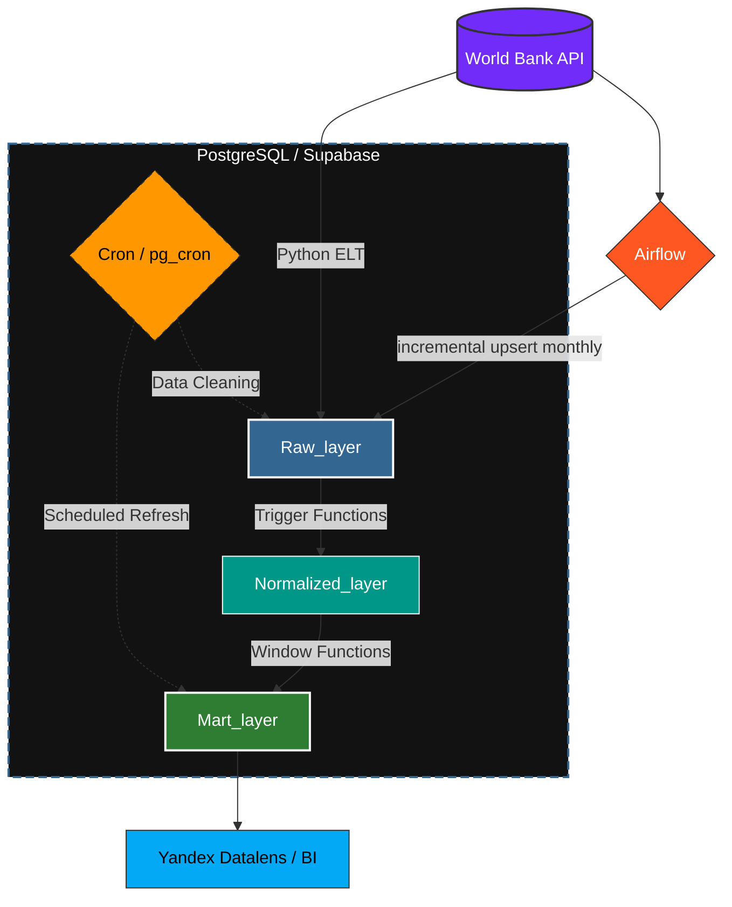

## Содержание
- [Цель и задачи](#title1)
  - [Postgresql](#title1.1)
  - 

## <a id="title1">Цель и задачи</a>

***Цель проекта*** - подготовка исторических данныых (социально-экономических показателей стран) из всемирного банка ([World Bank](https://datahelpdesk.worldbank.org/knowledgebase/topics/125589)) для анализа 

***Задачи***

1. Выбрать основу для хранилища данных, а также разарботать его структуру
2. Настроить взаимодействие с сервером WB для получения данных по API
3. Реализовать ETL/ELT пайплайн для загрзки данных из API WB в наше хранилище
4. Провести анализ

***Стек***

- Хранилище данных: СУБД Postgres (Облачная на базе Supabse, локальная docker), DBeaver (для работы с локальной СУБД)
- Работа с хранилищем и загрузка данных: Python, SOLalchemy, psycopg2, cron
- Взаимодействие с API: Python, requests
- Анализ в Python: Python, pandas, numpy, matplotlib, seeaborn, plotly, sklearn (PCA, кластериизация и линейная регрессия), scipy
- Визуализация: Yandex Datalens

## <a id="title1">Хранилище данных</a>

### <a id="title1.1">СУБД</a>

В первую очередь почему я выбрал Postgres в роли СУБД. Во первых данные получаемые из WB удрбно представлять в виде "сущность-связь", для этого отлично подходит реляционная модель данных. Postgres в целом довольно унверсальное опенсорс решение (как для OLTP так и OLAP задач). Для аналитики достаточно инструментов, начиная от агрегирующих функций, заканчивая оконными фукциями, удобно хранить аналитические отчеты в виде материализованных предсталний. Postgres полностью поддерживает ACID, любое изменение данных (даже при ошибках или сбоях) будет выполнено надежно, полностью и предсказуем; более легкое возможность изменения и удаления данных. Есть дополнительные расширения по типу cron

В рамках проекта я развернул локальную СУБД с поомщью контейнера docker - часть для отладки скрипта загрузки. Также я решил развернуть хранилище в облаке на базе Supabse. Во первых это интересно с точки зрения рельности - намного интереснее подключится к рельному сервису, причем бесплатно. Это в свою очередь накладывает определенныые ограничения но о них позже. Облачныый сервис нечто большее, делает работу с данными удобнее, есть уже встроенные инстурменты, которыми можно пользоваться сразу без дполнительной настройки(к примеру встроенный RESTApi. 

### <a id="title1.2">Инициализация хранилища данных</a>

Хранилище с даными можно инициализировать и заполнить прямо в скрипте. Для работы с подключением в Python, а также для загрузки данных в бд используется библиотека `sqlalchemy 2.0` в связке с `psycopg2` (библиотека для работы именно с СУБД postgres. Логика подключения вынесена в отдельный модуль. Отельный модуль для работы с хранилищем данных: реализованы основные необходимые методы: удалением данных, загрузкой. Структура хранилища данных описана в *декларативном* стиле с использованием `sqlalchemy 2.0` (таблицы). Это двольно удобно, более строгая типизация, удобство разового создания или удаления всех таблиц, использоание базового класса Base, позволяет объединять общие методы работы а также атрибуты для всех таблиц. Однако в проекте иницализация реализована смешано. Создане слоев, триггеров и соответсственно удаление реаизуется через выполнение raw_sql скриптов и *привязано* к событиям `Base.metadata.create_all()` `Base.metadata.drop_all_all()`, этоо все производится неявно и автоматически чтобы избежать ошибок неправильного порядка вызова при иницализации. Вообще в целом структура лежит в директории [models](https://github.com/ososovyan/WB_data_collector/tree/main/src/database/models): здесь лежит все, скрпты для иницализации, модели данных. То есть модуль работы с даными  вне конттекста архитектуры хранилища данных, что позволяет *переиспользовать* для решения других задач или для расширения проекта

