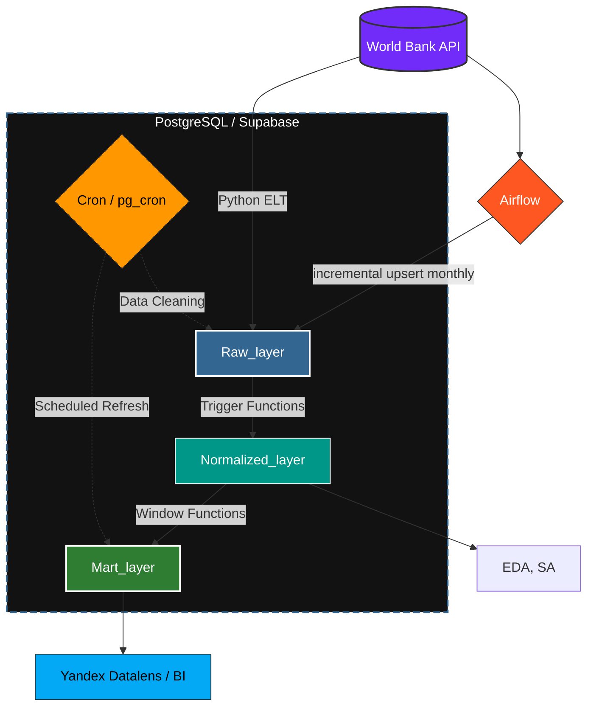
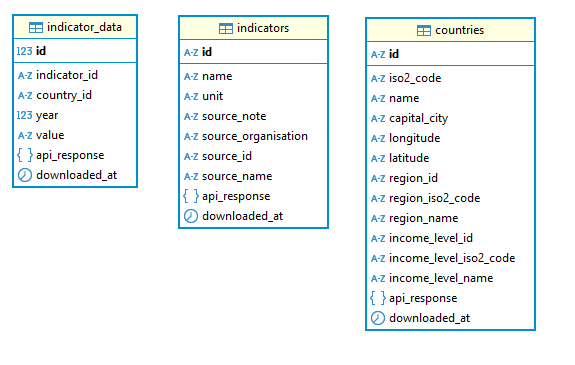
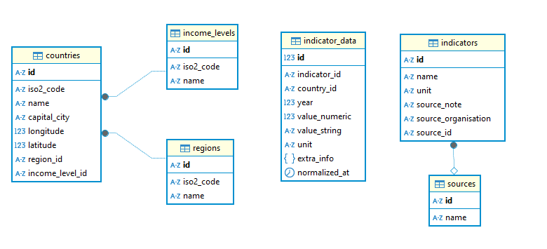

## Содержание
- [Цель и задачи](#title1)
  - [Postgresql](#title1.1)
  - [Инициализация хранилища данных](#title1.2)
  - [Архитектура хранилища данных](#title1.3)

## <a id="title1">Цель и задачи</a>

***Цель проекта*** - подготовка исторических данныых (социально-экономических показателей стран) из всемирного банка ([World Bank](https://datahelpdesk.worldbank.org/knowledgebase/topics/125589)) для анализа 

***Задачи***

1. Выбрать основу для хранилища данных, а также разарботать его структуру
2. Настроить взаимодействие с сервером WB для получения данных по API
3. Реализовать ETL/ELT пайплайн для загрзки данных из API WB в наше хранилище
4. Провести анализ

***Стек***

- Хранилище данных: СУБД Postgres (Облачная на базе Supabse, локальная docker), DBeaver (для работы с локальной СУБД)
- Работа с хранилищем и загрузка данных: Python, SOLalchemy, psycopg2, cron
- Взаимодействие с API: Python, requests
- Анализ в Python: Python, pandas, numpy, matplotlib, seeaborn, plotly, sklearn (PCA, кластериизация и линейная регрессия), scipy
- Визуализация: Yandex Datalens
- Служебные операции: crion, Airflow

## <a id="title1">Хранилище данных</a>

### <a id="title1.1">СУБД</a>

В первую очередь почему я выбрал Postgres в роли СУБД. Во первых данные получаемые из WB удрбно представлять в виде "сущность-связь", для этого отлично подходит реляционная модель данных. Postgres в целом довольно унверсальное опенсорс решение (как для OLTP так и OLAP задач). Для аналитики достаточно инструментов, начиная от агрегирующих функций, заканчивая оконными фукциями, удобно хранить аналитические отчеты в виде материализованных предсталний. Postgres полностью поддерживает ACID, любое изменение данных (даже при ошибках или сбоях) будет выполнено надежно, полностью и предсказуем; более легкое возможность изменения и удаления данных. Есть дополнительные расширения по типу cron

В рамках проекта я развернул локальную СУБД с поомщью контейнера docker - часть для отладки скрипта загрузки. Также я решил развернуть хранилище в облаке на базе Supabse. Во первых это интересно с точки зрения рельности - намного интереснее подключится к рельному сервису, причем бесплатно. Это в свою очередь накладывает определенныые ограничения но о них позже. Облачныый сервис нечто большее, делает работу с данными удобнее, есть уже встроенные инстурменты, которыми можно пользоваться сразу без дполнительной настройки(к примеру встроенный RESTApi. 

### <a id="title1.2">Инициализация хранилища данных</a>

Хранилище с даными можно инициализировать и заполнить прямо в скрипте. Для работы с подключением в Python, а также для загрузки данных в бд используется библиотека `sqlalchemy 2.0` в связке с `psycopg2` (библиотека для работы именно с СУБД postgres. Логика подключения вынесена в отдельный модуль. Отельный модуль для работы с хранилищем данных: реализованы основные необходимые методы: удалением данных, загрузкой. Структура хранилища данных описана в *декларативном* стиле с использованием `sqlalchemy 2.0` (таблицы). Это двольно удобно, более строгая типизация, удобство разового создания или удаления всех таблиц, использоание базового класса Base, позволяет объединять общие методы работы а также атрибуты для всех таблиц. Однако в проекте иницализация реализована смешано. Создане слоев, триггеров и соответсственно удаление реаизуется через выполнение raw_sql скриптов и *привязано* к событиям `Base.metadata.create_all()` `Base.metadata.drop_all_all()`, этоо все производится неявно и автоматически чтобы избежать ошибок неправильного порядка вызова при иницализации. Вообще в целом структура лежит в директории [models](https://github.com/ososovyan/WB_data_collector/tree/main/src/database/models): здесь лежит все, скрпты для иницализации, модели данных. То есть модуль работы с даными  вне конттекста архитектуры хранилища данных, что позволяет *переиспользовать* для решения других задач или для расширения проекта другими моделми данных

### <a id="title1.3">Архитектура хранилища данных</a>

Как можно было увидеть выше хранилище имеет три слоя

- ***Raw_layer***

  

  Слой для сырых данных полученных прямиком из апи. Таблица -> есть апи ответ от ендпоинта. В данном слое три таблицы две для справочников (общая информация о странах, о индикаторов) и таблица фактов (с показателями для страны за годы). В последнюю таблицу сразу выгружаются данные о нескольких показателях, путем авотматического перебора эндпоинтов api wb, для разных показателей. Также содержит ответ в формате json (можно хранить в формате jsonb для более оптимальной работы в postgres c noSQl моделями данных (возможно стоило грузить сырые jsonb и их обрабатывать в таком виде) однако они нужны номинально для истории загрзки, при необходимости можно изменить, тут больше про возможность работы с разными типами данных)

  Загрузка осущетсвляется батчами с возможностью выбора мода ('ON CONFLICT DO NOTHING', 'ON CONFLICT DO UPSERT') первый для загрузки при инициализации, второй для дозагрузки или обновления. Это позволяет быстро развернуть без лишних нагрузок, при этом обновлять исторические данные последних лет.

  Как видно связей нет чтобы избежать лишних конфликтов при загрузке

- ***Normalized_layer***

  

  Данный слой содержит данные нормализованные, этот слой основное хранилище данных. Тип "Снежинка" - свзяи таблицы фактов, с основными справочными таблицами на данном этапе виртуальные (семантика столбца country_id не совсем страна, поскольку wb выдает данные не только для стран но и для агрегированных групп, регионов, фильтрация разумаается будет, но уже в слой mart, поскльку данные по агрегированным регионам и группам возомжно использовать при анализе.

  Этот слой используется для разведочного и структурного анализа в Python

  Этот слой заполняется автоматически по тригеру (событие INSERT, UPDATE) и перетекает по мере загрузки или обновления данных, это разумеется нагружает работу бд, при вставке батчей начинается одновременная обработка, однако это обеспечивает целостность данных

- ***Mart_layer***

  Это слой аналитики. Основа плоское материализованное представление для стран, лет, индикаторов (здесь как раз произведена фильтрация по странам для знаений показателей. Также в этом слое лежат обычные представления для помощи в анализе, скорее не физически а просто для разделения назначения. Также произевдена линейная интерполяция пропущенных значний, подсчет некоторых метрик для показателей. Этот слой используется BI системами

Материлизованное представлние инициализируется при инициализации бд, также автоматически обноляется по окончании загрузки данных в таблицу фактов. Интересная деталь поскольку мы реализовали переход из raw - > norm триггером, используется одна и та же транзакция, загрузка формально не закончится до тех пор пока база не прольет послдний батч в нормализованный слой, поэтому обновление будет происходить корректно

